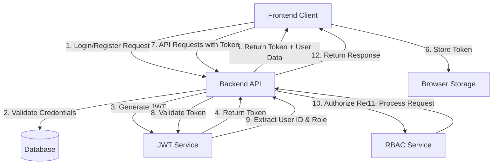

# Design Document: Email/Password Authentication System

## Overview

This design document outlines the architecture and implementation details for replacing the current Auth0-based authentication system with a custom email/password authentication system while maintaining the existing Role-Based Access Control (RBAC) functionality. The new system will handle user registration, login, session management, password reset, and role-based authorization without relying on external identity providers.

## Architecture

The authentication system will follow a token-based architecture using JSON Web Tokens (JWT) for session management. This approach maintains compatibility with the existing frontend/backend structure while replacing the Auth0 dependency.

### High-Level Architecture



### Authentication Flow

1. **Registration Flow**:
   - User submits email and password
   - Backend validates input
   - Password is hashed using bcrypt
   - User record is created with default role
   - JWT token is generated and returned

2. **Login Flow**:
   - User submits email and password
   - Backend validates credentials
   - JWT token is generated with user ID and role claims
   - Token and user profile are returned to client

3. **Authorization Flow**:
   - Client includes JWT in Authorization header
   - Backend middleware validates token
   - User ID and role are extracted from token
   - Request is authorized based on role permissions
   - Protected resource is returned if authorized

4. **Password Reset Flow**:
   - User requests password reset
   - Backend generates reset token and stores with expiration
   - Email with reset link is sent to user
   - User submits new password with reset token
   - Backend validates token and updates password

## Components and Interfaces

### Backend Components

#### 1. Authentication Controller

Handles user registration, login, and password management endpoints.

```go
// auth_controller.go
package handlers

type AuthController struct {
    userRepo    repositories.UserRepository
    tokenService services.TokenService
    emailService services.EmailService
}

func (c *AuthController) Register(w http.ResponseWriter, r *http.Request)
func (c *AuthController) Login(w http.ResponseWriter, r *http.Request)
func (c *AuthController) ChangePassword(w http.ResponseWriter, r *http.Request)
func (c *AuthController) RequestPasswordReset(w http.ResponseWriter, r *http.Request)
func (c *AuthController) ResetPassword(w http.ResponseWriter, r *http.Request)
func (c *AuthController) Logout(w http.ResponseWriter, r *http.Request)
```

#### 2. Authentication Middleware

Replaces the Auth0 middleware with JWT validation.

```go
// auth_middleware.go
package middleware

type AuthMiddleware struct {
    tokenService services.TokenService
    userRepo     repositories.UserRepository
}

func (m *AuthMiddleware) Authenticate(next http.Handler) http.Handler
func (m *AuthMiddleware) RequireRole(roles ...string) func(http.Handler) http.Handler
```

#### 3. Token Service

Handles JWT token generation and validation.

```go
// token_service.go
package services

type TokenClaims struct {
    UserID int64  `json:"user_id"`
    Role   string `json:"role"`
    jwt.StandardClaims
}

type TokenService interface {
    GenerateToken(user *models.User) (string, error)
    ValidateToken(tokenString string) (*TokenClaims, error)
    GeneratePasswordResetToken(userID int64) (string, error)
    ValidatePasswordResetToken(tokenString string) (int64, error)
}
```

#### 4. User Repository

Manages user data persistence.

```go
// user_repository.go
package repositories

type UserRepository interface {
    FindByID(id int64) (*models.User, error)
    FindByEmail(email string) (*models.User, error)
    Create(user *models.User) error
    Update(user *models.User) error
    StoreResetToken(userID int64, token string, expiry time.Time) error
    GetResetToken(token string) (int64, error)
    InvalidateResetToken(token string) error
}
```

#### 5. Email Service

Handles sending password reset emails.

```go
// email_service.go
package services

type EmailService interface {
    SendPasswordResetEmail(to string, resetLink string) error
}
```

### Frontend Components

#### 1. Authentication Service

Replaces Auth0 client with direct API calls.

```typescript
// authService.ts
export interface AuthService {
  register(email: string, password: string): Promise<AuthResponse>;
  login(email: string, password: string): Promise<AuthResponse>;
  logout(): void;
  isAuthenticated(): boolean;
  getToken(): string | null;
  getUser(): AppUser | null;
  changePassword(currentPassword: string, newPassword: string): Promise<void>;
  requestPasswordReset(email: string): Promise<void>;
  resetPassword(token: string, newPassword: string): Promise<void>;
}

export interface AuthResponse {
  token: string;
  user: AppUser;
}
```

#### 2. API Service

Updates API service to include token in requests.

```typescript
// apiService.ts
export class ApiService {
  private baseUrl: string;
  private authService: AuthService;
  
  constructor(baseUrl: string, authService: AuthService) {
    this.baseUrl = baseUrl;
    this.authService = authService;
  }
  
  async get<T>(path: string): Promise<T> {
    return this.request<T>('GET', path);
  }
  
  async post<T>(path: string, data: any): Promise<T> {
    return this.request<T>('POST', path, data);
  }
  
  private async request<T>(method: string, path: string, data?: any): Promise<T> {
    const headers: HeadersInit = {
      'Content-Type': 'application/json',
    };
    
    const token = this.authService.getToken();
    if (token) {
      headers['Authorization'] = `Bearer ${token}`;
    }
    
    // Request implementation
  }
}
```

#### 3. Authentication Components

UI components for registration, login, and password management.

```typescript
// Components needed:
// - RegisterForm.svelte
// - LoginForm.svelte
// - ChangePasswordForm.svelte
// - RequestPasswordResetForm.svelte
// - ResetPasswordForm.svelte
```

## Data Models

### User Model Updates

The existing User model needs minimal changes to support password-based authentication:

```go
// user.go
package models

type User struct {
    ID            int64     `json:"id" gorm:"primaryKey"`
    Email         string    `json:"email" gorm:"column:email;uniqueIndex"`
    Username      string    `json:"username" gorm:"column:username;uniqueIndex"`
    PasswordHash  string    `json:"-" gorm:"column:password_hash"`  // New field
    Role          string    `json:"role" gorm:"column:role;default:'requester'"`
    PictureURL    string    `json:"picture_url,omitempty" gorm:"column:picture_url"`
    Department    *string   `json:"department,omitempty" gorm:"column:department"`
    ContactNumber *string   `json:"contact_number,omitempty" gorm:"column:contactNumber"`
    IsActive      bool      `json:"is_active" gorm:"column:isActive;default:true"`
    CreatedAt     time.Time `json:"created_at"`
    UpdatedAt     time.Time `json:"updated_at"`
}
```

### Password Reset Token Model

New model to store password reset tokens:

```go
// password_reset.go
package models

type PasswordReset struct {
    ID        int64     `gorm:"primaryKey"`
    UserID    int64     `gorm:"column:user_id;index"`
    Token     string    `gorm:"column:token;uniqueIndex"`
    ExpiresAt time.Time `gorm:"column:expires_at"`
    CreatedAt time.Time
}
```

## Error Handling

The authentication system will use standardized error responses:

```go
// errors.go
package auth

type AuthError struct {
    Code    string `json:"code"`
    Message string `json:"message"`
}

var (
    ErrInvalidCredentials = AuthError{Code: "invalid_credentials", Message: "Invalid email or password"}
    ErrEmailExists        = AuthError{Code: "email_exists", Message: "Email already registered"}
    ErrInvalidToken       = AuthError{Code: "invalid_token", Message: "Invalid or expired token"}
    ErrUnauthorized       = AuthError{Code: "unauthorized", Message: "Unauthorized access"}
    ErrInvalidPassword    = AuthError{Code: "invalid_password", Message: "Password does not meet requirements"}
    // Additional errors...
)
```

## Security Considerations

1. **Password Storage**:
   - Passwords will be hashed using bcrypt with appropriate cost factor
   - Plain text passwords will never be stored or logged

2. **Token Security**:
   - JWTs will be signed with a secure algorithm (HMAC SHA-256)
   - Short expiration times with refresh token mechanism
   - Token secret stored securely in environment variables

3. **Input Validation**:
   - All user inputs will be validated and sanitized
   - Email format validation
   - Password strength requirements enforced

4. **Rate Limiting**:
   - Implement rate limiting for login attempts
   - Exponential backoff for failed login attempts

5. **HTTPS**:
   - All API endpoints must be served over HTTPS
   - Secure cookie flags for token storage

## Testing Strategy

1. **Unit Tests**:
   - Test each authentication service function
   - Test token generation and validation
   - Test password hashing and verification

2. **Integration Tests**:
   - Test authentication flow end-to-end
   - Test middleware with various token scenarios
   - Test role-based access control

3. **Security Tests**:
   - Test for common vulnerabilities (OWASP Top 10)
   - Test rate limiting effectiveness
   - Test token expiration and refresh

4. **Migration Tests**:
   - Test migration from Auth0 to new system
   - Verify existing users can set passwords
   - Verify role preservation

## Migration Plan

1. **Database Schema Updates**:
   - Add password_hash column to users table
   - Create password_resets table
   - Update database indexes

2. **Implementation Phases**:
   - Phase 1: Implement core authentication backend
   - Phase 2: Implement frontend components
   - Phase 3: Test with subset of users
   - Phase 4: Full migration with user notification

3. **Rollback Plan**:
   - Maintain Auth0 configuration during transition
   - Implement feature flag to switch between auth systems
   - Monitor error rates during migration